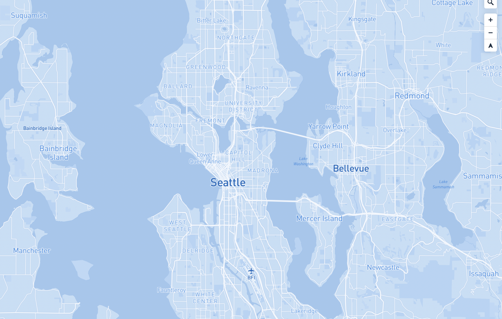
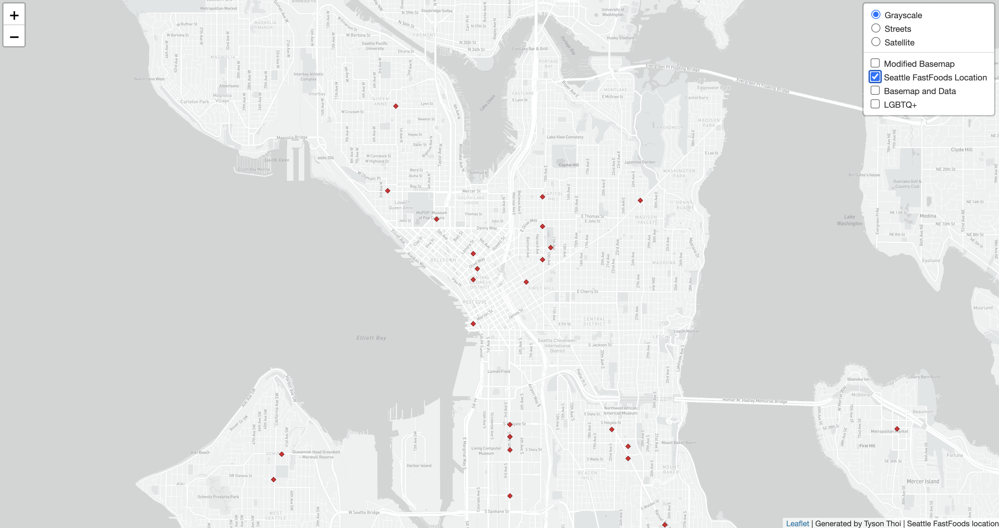
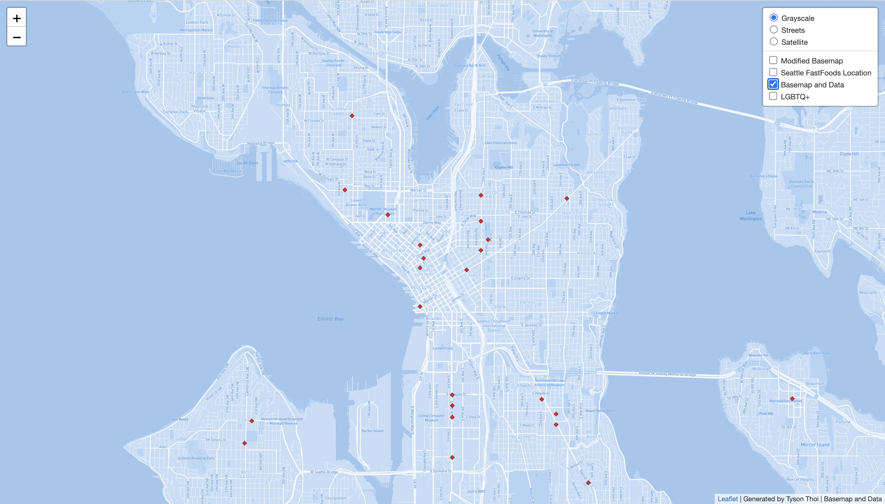
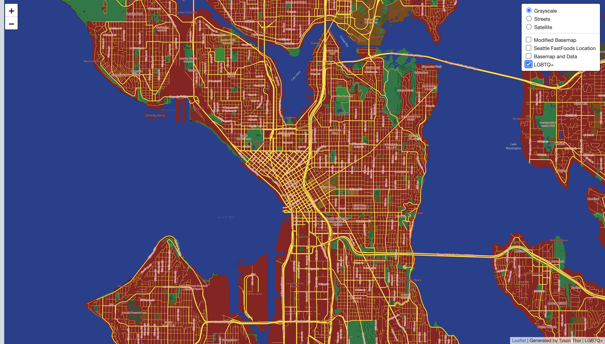

# Generating Map Tiles

#### Github Page -  https://tpthoi.github.io/Generating-Map-Tiles-Lab-04-TT/
## Tile 1 - Modified Basemap

- Description of Tile: Modified basemap simplified by increasing the font size of the networking streets, major roads, city names, and major neighborhoods in the seattle area. 
- Geographic Area of Focus: Seattle Washington and neighboring cities 
- Zoom Levels: Max Zoom - 14; Min Zoom - 10

## Tile 2 - Map Data (Fast Foods Location, Seattle)

- Description of Tile: Data layer showing the location of fast foods resturant near Seattle in 2007.
- Geographic Area of Focus: Seattle Washington and neighboring cities 
- Zoom Levels: Max Zoom - 14; Min Zoom - 10

## Tile 3 - Basemap and Data 

- Description of Tile: Tile using the initial modified basemap and the mapped data from the second tile.
- Geographic Area of Focus: Seattle Washington and neighboring cities  
- Zoom Levels: Max Zoom - 14; Min Zoom - 10

## Tile 4 - LGBTQ+ Communities Theme

- Description of Tile: Created using a color scheme inspired by LGBTQ+ Communities. 
- Geographic Area of Focus: Seattle Washington and neighboring cities 
- Zoom Levels: Max Zoom - 14; Min Zoom - 10
